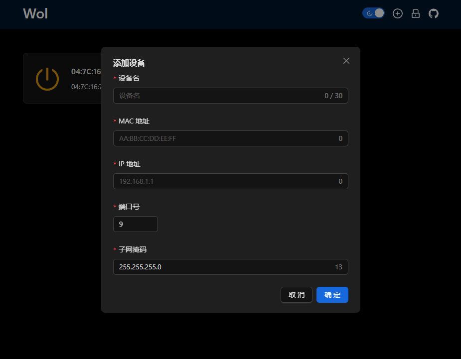

# wol

Wol 是 wake on lan 的简写，是一个轻量、简洁的 Wol 管理服务，支持检测设备是否开机成功。

## 功能特性

- 部署简单，且可私有部署。
- 默认使用 yaml 作为配置文件，易于编辑与迁移。
- 主题切换：支持浅色主题与暗黑主题。
- 占用资源少，运行速度快。
- 跨平台：可以在 Linux、macOS 和 Windows 操作系统上运行。
- 支持 basic auth，保护服务配置
- 支持检测设备是否启动（设备需支持 ping）

## 项目截图

| 截图                                                    | 说明         |
| ------------------------------------------------------- | ------------ |
|          | 浅色主题     |
|          | 深色主题     |
|      | 添加新设备   |
|  | 开启页面认证 |
|          | 页面认证     |

## 安装和使用

### Docker 中使用（Linux 推荐）

推荐使用 Docker 安装方式，使用简单方便，只需运行如下命令：

```sh
docker pull ghcr.io/nashaofu/wol:latest

# 使用docker host模式
docker run -d \
  --name wol \
  --net host \
  -v /path/to/wol.yaml:/opt/wol/yaml \
  ghcr.io/nashaofu/wol:latest

# 不使用docker host模式
docker run -d \
  --name wol \
  -p 3300:3300 \
  -v /path/to/wol.yaml:/opt/wol/yaml \
  ghcr.io/nashaofu/wol:latest
```

然后在浏览器中访问 `http://127.0.0.1:3300` 即可使用。

如果需要自定义配置，可将项目根目录下的 `wol.example.yaml` 文件拷贝到 `/opt/wol` 目录下并重命名为 `wol.yaml`，具体配置参考配置章节，也可以修改启动命令，指定配置文件位置。

### 系统中使用(Windows/Mac 推荐)

Windows/Mac 桌面版的 docker 不支持`--net=host`,所以推荐这种使用方式。

1. 前往[release](https://github.com/nashaofu/wol/releases)页面下载`wol-xxxx.zip`，`xxxx`表示系统架构，请根据自己的情况选择
2. 解压出`wol-xxxx.zip`中的可执行文件，然后在终端中运行即可启动服务。同时也支持在启动时指定服务的端口号与配置文件。

   ```bash
   Usage: wol [OPTIONS]

   Options:
     -p, --port <PORT>      App listen port [default: 3300]
     -c, --config <CONFIG>  Config file path [default: ./wol.yaml]
     -h, --help             Print help
     -V, --version          Print version
   ```

## 配置

项目配置文件为`wol.yaml`，配置内容如下：

```yaml
# basic auth 配置，auth 可为 null，表示关闭认证
auth:
  username: ""
  password: ""
# 设备列表
devices:
  - name: Windows # 设备名称
    mac: 00:00:00:00:00:00 # 设备 mac 地址
    ip: 192.168.1.1 # 设备 ipv4 地址
    port: 9 # wake on lan 唤醒端口号，一般为 9、7 或者 0
```

## 贡献指南

如果您想为 Wol 做出贡献，可以按照以下步骤进行：

1. 克隆项目到本地：

   ```sh
   git clone https://github.com/nashaofu/wol.git
   ```

2. 创建新分支：

   ```sh
   git checkout -b my-feature-branch
   ```

3. 启动项目：你需要安装 rust、nodejs 与 yarn

   ```sh
   # 启动服务端项目
   cargo run
   # 启动前端项目
   cd client && yarn && yarn dev
   ```

4. 修改并提交代码：

   ```sh
   git add .
   git commit -m "Add new feature"
   ```

5. 推送代码到远程仓库：

   ```sh
   git push origin my-feature-branch
   ```

6. 创建 Pull Request：在 GitHub 上创建一个新的 Pull Request 并等待审核。

## 许可证

Wol 使用 Apache 许可证，详情请参阅 [LICENSE](LICENSE) 文件。
